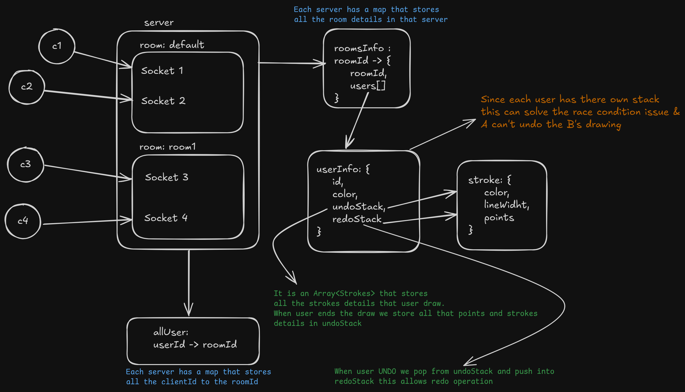

# 🎨 Real-Time Collaborative Drawing Canvas — ARCHITECTURE.md

---

## 🧩 1. Overview

The **Real-Time Collaborative Drawing Canvas** is a multi-user web application that allows several users to draw simultaneously on a shared digital canvas.  
It uses **WebSockets (Socket.IO)** for bi-directional real-time communication between clients and the server.

The system enables:
- Real-time synchronized drawing between all users in a room  
- Per-user undo and redo functionality  
- Room-based isolation for collaboration sessions  
- Approximate user location identification via GeoIP  
- Smooth rendering using buffered strokes  
- Scalable architecture with low latency  

---

## 🏗️ 2. System Components

| Component | Description |
|------------|-------------|
| **Client (Browser)** | Frontend interface using HTML5 Canvas, TailwindCSS, and Socket.IO client. Captures drawing actions, emits them to the server, and renders remote updates. |
| **Server (Express + Socket.IO)** | Manages rooms, connected users, synchronization, undo/redo state, and broadcasts drawing data to all clients in a room. |
| **Room Manager** | Maintains per-room state, including connected users, undo/redo stacks, and active strokes. |
| **GeoIP Module** | Resolves IP addresses to approximate city, region, and country for display. |
| **Deployment Environment** | Node.js + Render Cloud used for hosting and scalability. |

---

## 🖼️ 3. Architecture Diagram



---

## 🔁 4. Data Flow Diagram

### Real-Time Drawing Flow
```plaintext
User Action (Draw Stroke)
        │
        ▼
Client captures pointer events
        │
        ▼
Buffer of stroke points (every 40ms)
        │
        ▼
Socket.IO emits → {room, color, width, points}
        │
        ▼
Server receives event → identifies room
        │
        ▼
Broadcasts stroke to other users in same room
        │
        ▼
Each client renders received stroke locally
```

### Undo/Redo Flow
```
Undo click → client emits "undo"
Server pops last stroke from user's undoStack
Moves it to redoStack
Rebuilds canvas for all users → emit("newStrokes")
```

## 5. Data Models
```js
type Stroke = {
  color: string;
  lineWidth: number;
  points: { x: number; y: number }[];
};

type UserInfo = {
  id: string;
  color: string;
  ip: string;
  undoStack: Stroke[];
  redoStack: Stroke[];
};

type Room = {
  id: string;
  users: UserInfo[];
};
```

## 6. Tech Stack

| Layer          | Technology                           | Purpose                        |
| -------------- | ------------------------------------ | ------------------------------ |
| **Frontend**   | HTML5, TailwindCSS, Socket.IO client | Canvas rendering, drawing UI   |
| **Backend**    | Node.js, Express, Socket.IO          | Real-time events, server logic |
| **GeoIP**      | `geoip-lite`                         | IP-to-location lookup          |
| **Language**   | TypeScript                           | Type-safe backend code         |
| **Hosting**    | Render                               | Cloud deployment               |
| **Build Tool** | `tsc` (TypeScript compiler)          | Generates JS build in `/dist`  |


## 🚀 6. Deployment Flow

1. Build Step:
```console
pnpm install
pnpm run build
```
Transpiles TypeScript to JavaScript inside /dist.

2. Deploy Step:
Render automatically runs:
```console
node dist/server/server.js
```

3. Static Files:
Served from /dist/public.

4. Port Handling:
Uses process.env.PORT for dynamic Render port binding.

## Future Enhancement
| Feature                | Description                              |
| ---------------------- | ---------------------------------------- |
| Cursor synchronization | Show live cursor for each connected user |
| Persistent storage     | Save canvas history in DB                |
| Replay feature         | View drawing playback                    |
| Chat integration       | Real-time chat per room                  |


